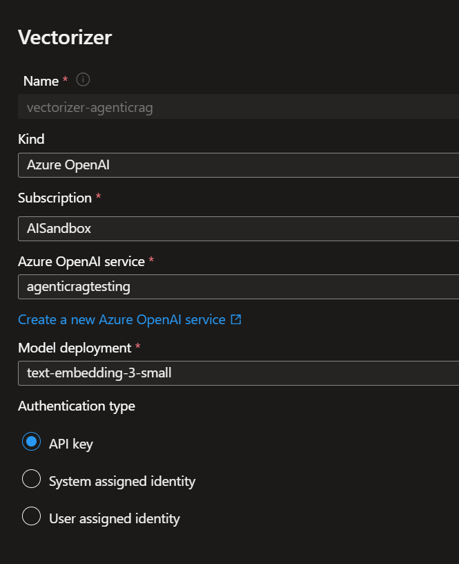
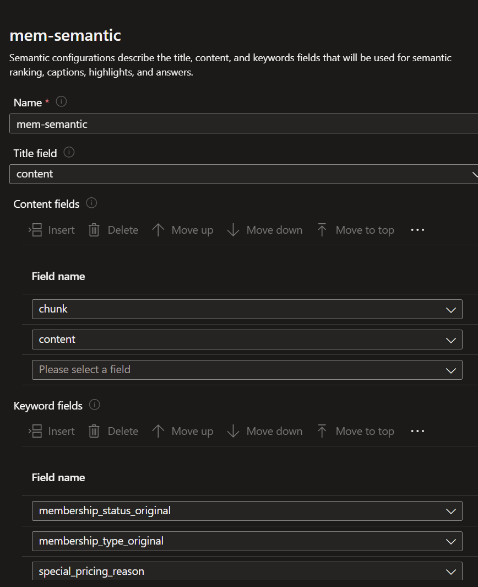
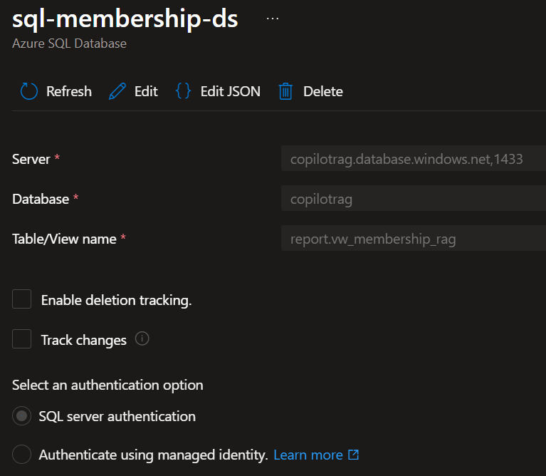

# Azure AI Search configuration (Modern RAG retrieval)

- This section records what we configured, why, and how for the retrieval layer that powers the Agentic RAG app. Project background and data model live in the root README and SQL scripts.

## Search service application and RAG index

### Purpose

- Create a chunk‑level, hybrid index for Modern RAG: full‑text + vectors with semantic re‑ranking.
- Hybrid queries run lexical and vector branches in parallel and fuse results using RRF, while semantic ranking improves relevance and can return extractive answers and captions.

### What we configured

##### Index name:
- membership-rag-idx.

#### Core fields:
- id (key, non‑searchable, keyword analyzer).
- content (source text per record from SQL).
- chunk (split unit used at retrieval).
- chunkVector (Collection(Edm.Single), 1536‑dim).
- Filter/facet fields: gradeName, hubName, membership_status_original, membership_type_original, special_pricing_reason, created_utc.


#### Vector search:
- HNSW profile; Azure OpenAI vectorizer bound to the profile so we can send vectorQueries: [{ "kind":"text" }] at query time.


#### Semantic config:
- mem-semantic with prioritized content fields [chunk, content] and relevant keyword fields (grade, hub, status). Queries use queryType: "semantic" and semanticConfiguration: "mem-semantic".


### How we did it

- Created the index via REST using the 2025‑09‑01 API.
- Added vectorSearch.vectorizers (Azure OpenAI embedding deployment) and referenced it from the HNSW vector profile assigned to chunkVector.

### Why this shape

- Chunk‑level docs improve grounding and citation quality in RAG.
- The vectorizer enables text‑to‑vector queries without pushing embeddings from the client.

### Upstream content

- The source text is built in SQL view report vw_membership_rag, which assembles readable sentences with join status, dates, grade, and hub; this is what we split and embed.


## Azure SQL data source + indexer with integrated vectorization

### Purpose

- Automate ingestion from Azure SQL and enrich rows into retrieval‑ready chunks with vectors. Integrated vectorization runs a skillset in the indexer: split text then call Azure OpenAI Embeddings

### What we configured

#### Data source:
- sql-membership-ds targeting report.vw_membership_rag



#### Skillset:
- TextSplitSkill with pages mode, ~256‑token equivalent (we used 1200 chars max length with 300 chars overlap) to create /document/pages/*. 

- AzureOpenAIEmbeddingSkill (text-embedding-3-small, 1536‑dim) to generate /embedding for each page. Supports Azure OpenAI resourceUri on *.openai.azure.com.

#### Output mapping (index projections):

- pages[*] → chunk
- pages[*].embedding → chunkVector

#### How we did it

- Created data source, skillset, and indexer over REST (2025‑09‑01).
- Ran the indexer. Ingestion completed with 0 errors/warnings and ~11.8k chunk docs (per portal run results).
- Assigned the search service identity db_datareader on the SQL DB.

#### Why this shape

- Splitting enforces LLM/embedding size limits and improves recall.
- Embedding at index time keeps query latency low and shifts cost to ingestion.

## Query with hybrid + semantic (RRF + answers)

### Purpose

- Validate Modern RAG retrieval: lexical + vector fused by RRF, re‑ranked semantically, with optional extractive answers and captions for better summaries.

#### How we queried (example payload)

```
POST https://{service}.search.windows.net/indexes/membership-rag-idx/docs/search?api-version=2025-09-01
{
  "search": "Show active memberships in September 2025",
  "queryType": "semantic",
  "semanticConfiguration": "mem-semantic",
  "answers": "extractive|count-3",
  "captions": "extractive|highlight-true",
  "select": "id,chunk,content,gradeName,hubName,membership_status_original,membership_type_original,special_pricing_reason",
  "vectorQueries": [
    { "kind": "text", "text": "active memberships in September 2025", "fields": "chunkVector", "k": 50, "weight": 1.0 }
  ],
  "top": 10
}

```

#### Hybrid:
- one lexical branch (search) + one vector branch (vectorQueries) run in parallel; RRF merges the two lists.

#### Semantic:
- queryType:"semantic" with semanticConfiguration applies the semantic reranker and enables answers/captions (answers are extractive passages from documents).

#### Notes
- Semantic answers are verbatim spans from documents; they don’t compute totals. Numerical results should come from SQL or a metrics index with count:true and filters.

### Source view and data lineage

- Data originates from the warehouse tables under dwh.* (facts and dims), generated by the synthetic loader, and surfaced via report.vw_membership_rag for RAG ingestion.

### What’s next

- Build a LangGraph agent to orchestrate retrieval and, when needed, call SQL for computed answers. The agent will use this index for grounding and citations; SQL or a metrics index provides exact counts. (See Azure AI Search docs for semantic, hybrid, vectorizers, and integrated vectorization references above.)