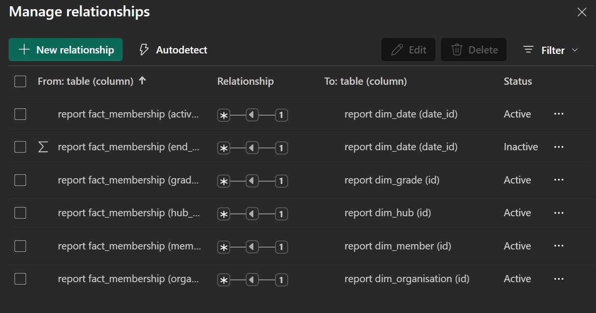
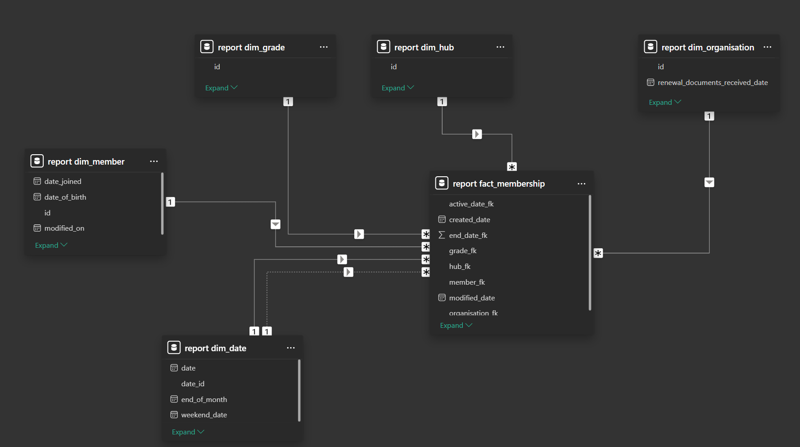
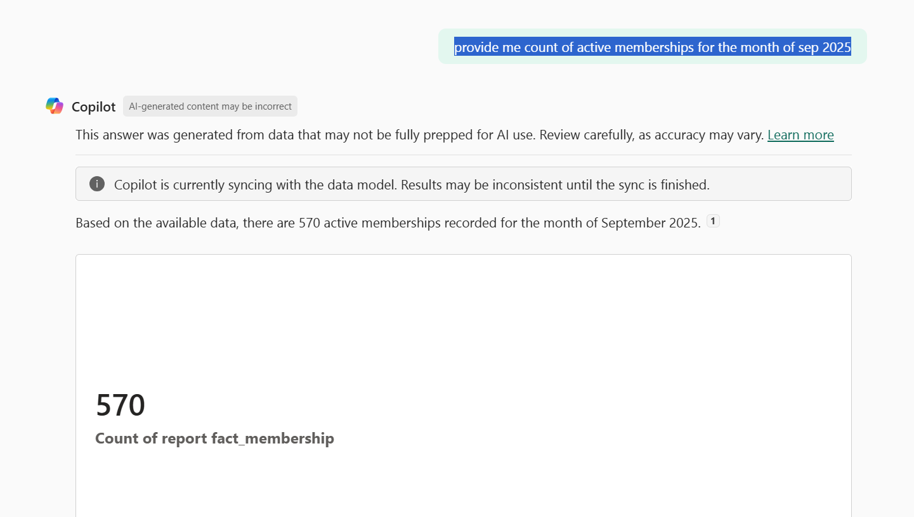

# MS Copilot Agentic RAG Evaluation — Data Preparation-SemanticModeling-Copilot-Testing

## Scope
Seed the warehouse in Azure SQL, generate two years of realistic daily membership activity, and expose reporting views for Power BI. Outputs: DWH tables populated, reporting views created, and a published semantic model in Microsoft Fabric.

## Azure SQL environment (current)
- Subscription: AISandbox (ID redacted here)
- Resource group: `copilot-agenticrag-rg`
- Server: `copilotrag.database.windows.net`
- Database: `copilotrag`
- Authentication used: SQL login `copilotrag` (password not stored in this README)
- Collation: `SQL_Latin1_General_CP1_CI_AS`
- Serverless compute: GP_Gen5_2 vCores, 32 GB storage

> Note: do not commit secrets. Store the SQL password in a user secret or local .env file. Firewall rules must allow your client IP and Azure services.

## Warehouse objects created
Schema: `dwh`  
Tables: `dim_date`, `dim_grade`, `dim_hub`, `dim_member`, `dim_organisation`, `dim_product`, `fact_invoice`, `fact_membership`, `fact_payment`, `fact_renewal`.

## Scripts
- **01_create_schemas_and_tables.sql** — creates the `dwh` schema and all tables.
- **02_generate_synthetic_data_v7_2.sql** — synthetic loader (current). Hotfixes over v7.1: corrected aliasing in random pick tables, and carried `invoice_id` through admissions for later joins. Includes idempotent run marker table `dwh.__synthetic_run`.
- **03_create_views.sql** (or equivalent) — creates reporting views consumed by Power BI.

### Membership rules enforced by the generator
- Individuals: one‑year membership ending **31‑Dec of the join year**; `active_date_fk` is the first day of the join month.
- Companies: membership ends at **start_date + 1 year − 1 day**; `active_date_fk` still first of month.
- Upgrades: new fact row retains the same `membership_id`, sets `prev_grade_fk`, marks `membership_type_original='Upgrade'` and `is_upgrade=1`.
- Rejoins: if a member resigned and rejoined in the same year, a new row retains `membership_id`, sets `membership_type_original='Rejoin'` and `is_reinstatement=1`.
- Attrition: `membership_status_original IN ('Resigned','Deceased')` implies `is_attrition=1`.
- `end_date_fk` is always `31‑Dec` of the membership year and never `NULL`.
- `special_pricing_reason` values: `standard | concession | maternity | academic`.

### Data realism levers
- Daily volumes by month and day‑of‑week weights.
- Grade and hub chosen by weighted mixes.
- Product aligned with grade.
- Payment mix: One‑off and Direct Debit (monthly).
- Deterministic name lists, age distribution buckets, and randomized organisations.

## How to run (Windows + VS Code + PowerShell)

### 0) Prerequisites
- VS Code with the “SQL Server (mssql)” extension or the SqlServer PowerShell module.
- PowerShell module: `Install-Module SqlServer -Scope CurrentUser -Force`

### 1) Create schema and tables
Open `01_create_schemas_and_tables.sql` in VS Code, connect to Azure SQL, and execute. Or run in PowerShell:

```powershell
$server   = "copilotrag.database.windows.net"
$database = "copilotrag"
$login    = "copilotrag"
$password = Read-Host -AsSecureString "SQL password"
$cred     = New-Object System.Management.Automation.PSCredential($login, $password)
Invoke-Sqlcmd -ServerInstance $server -Database $database -Credential $cred -InputFile "._create_schemas_and_tables.sql"
```

### 2) Generate synthetic data
Execute `02_generate_synthetic_data_v7_2.sql`. The script seeds reference dims if empty, then produces:
- Admissions with invoices and payments
- Upgrades within the same `membership_id`
- Rejoins within year
- Renewals with invoices, payments, and renewal facts

To fix the time window for reproducibility, set:
```sql
-- In the script header
-- DECLARE @EndDate date = '2025-10-30';
```

Run from PowerShell if preferred:
```powershell
Invoke-Sqlcmd -ServerInstance $server -Database $database -Credential $cred -InputFile "._generate_synthetic_data_v7_2.sql"
```

## Validation snippets
End date and active date rules:
```sql
-- end_date_fk must be 31-Dec
SELECT COUNT(*) AS bad_rows
FROM dwh.fact_membership
WHERE membership_type_original='Join' AND end_date_fk % 10000 <> 1231;

-- active_date_fk must be first of month (day=01)
SELECT COUNT(*) AS bad_rows
FROM dwh.fact_membership
WHERE active_date_fk % 100 <> 1;
```

Individual vs company expiry:
```sql
-- Individuals: expiry 31-Dec of join year
SELECT COUNT(*) AS bad_individuals
FROM dwh.fact_membership
WHERE membership_type_original='Join' AND organisation_fk IS NULL
  AND expiry_date_fk % 10000 <> 1231;

-- Companies: expiry = start_date + 1 year - 1 day
SELECT COUNT(*) AS bad_companies
FROM dwh.fact_membership
WHERE membership_type_original='Join' AND organisation_fk IS NOT NULL
  AND expiry_date_fk <> CAST(CONVERT(char(8),
        DATEADD(day,-1, DATEADD(year,1,CONVERT(date,CONVERT(varchar(8),start_date_fk),112))),112) AS int);
```

Flags and pricing:
```sql
SELECT membership_type_original, SUM(CASE WHEN is_admission=1 THEN 1 ELSE 0 END) AS admissions,
       SUM(CASE WHEN is_upgrade=1 THEN 1 ELSE 0 END)    AS upgrades,
       SUM(CASE WHEN is_reinstatement=1 THEN 1 ELSE 0 END) AS rejoins,
       SUM(CASE WHEN is_attrition=1 THEN 1 ELSE 0 END)  AS attritions
FROM dwh.fact_membership GROUP BY membership_type_original;

SELECT special_pricing_reason, COUNT(*) FROM dwh.fact_membership GROUP BY special_pricing_reason;
```

## Re‑runs and reset
The generator writes a row into `dwh.__synthetic_run` for the `(start_date, end_date)` window and exits if it already exists. To regenerate, delete from this table and truncate the fact tables before re‑running:

```sql
DELETE FROM dwh.__synthetic_run;
TRUNCATE TABLE dwh.fact_payment;
TRUNCATE TABLE dwh.fact_invoice;
TRUNCATE TABLE dwh.fact_renewal;
TRUNCATE TABLE dwh.fact_membership;
```

### 3) Create reporting views
Execute your `03_create_views.sql` (or the provided `views.txt` converted to a .sql file). Views should project user‑friendly columns under a `report` schema and respect existing column spellings; bracket‑quote any names with spaces or typos, for example `[original class]` or `registered_disables_tatus`.

### 4) Build the Power BI semantic model

- Connect Power BI Desktop to copilotrag using Import or DirectQuery. Select the report views only.

- Relationships to set or validate:

  - report fact_membership[hub_fk] → report dim_hub[id]

  - report fact_membership[grade_fk] → report dim_grade[id]

  - report fact_membership[member_fk] → report dim_member[id]

  - report fact_membership[active_date_fk] → report dim_date[date_id]

  - report fact_membership[organisation fk] → report dim_organisation[id]

  - inactive: report fact_membership[end_date_fk] → report dim_date[date_id]

- Publish dataset and report to the Fabric workspace that runs on your F2 capacity.






### 5) Validation in Fabric Copilot

- Example prompt: “provide me count of active memberships for the month of sep 2025”.
- Expected behavior: Copilot queries the dataset and returns a count from report fact_membership filtered by active_date_fk within the month.




### 6) Deliverables in this stage

- Azure SQL database configured.

- DWH schemas and tables created per 01_create_schemas_and_tables.sql.

- Synthetic data generated with membership rules and fixes (v7.2).

- Reporting views created for BI consumption.

- Power BI dataset and relationships published to Fabric.

- Query validation with MS Copilot 